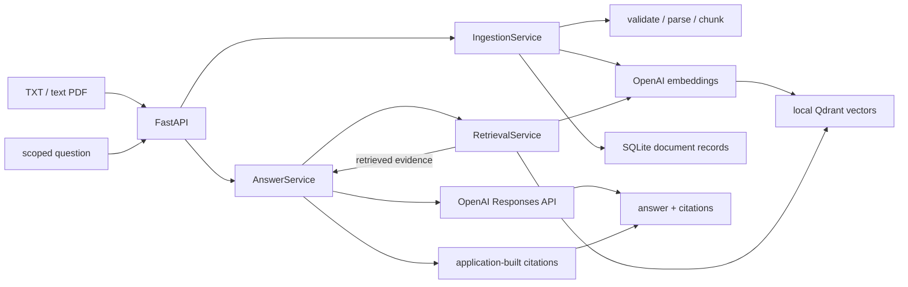

# Enterprise Knowledge Assistant（RAG V1）

一个可运行、可测试、可解释的企业知识库问答后端作品集。它使用
FastAPI 接收 TXT/PDF 文档，将文档切块后写入本地 SQLite 与 Qdrant，
并通过 OpenAI embedding 和 LLM 生成限定文档范围的回答与结构化引用。

> 当前状态：V1 功能闭环已完成，面向本地单用户演示。它展示企业 RAG
> 的工程边界，但尚未提供认证、多租户或公网生产部署能力。

## 项目亮点

- 模块化单体：HTTP、业务服务、领域模型、provider 和存储适配器分层。
- 安全摄取：扩展名与媒体类型双重校验、大小限制、安全路径和失败回滚。
- 范围检索：请求必须显式选择文档，检索前后均验证 `document_id`。
- 可信引用：文件名、页码、chunk ID 和分数由应用从真实检索结果构造。
- 隐私边界：不记录问题、文档内容、prompt、回答、向量、密钥或本地路径。
- 可重复评估：10 份合成文档、20 道题，不使用 API Key 即可运行。
- 自动质量门槛：Ruff、85% 分支覆盖率、全量测试和离线评估进入 CI。

## 架构



主要数据流是：上传 → 校验 → 解析 → 切块 → embedding → 持久化 →
限定文档检索 → 基于证据回答 → 结构化引用。摄取失败时会补偿删除已经写入的
向量和文件，并保留安全的失败状态记录。

## 快速开始（Windows / Python 3.12）

### 1. 创建项目专用虚拟环境

以下命令只在当前项目创建 `.venv`，不会修改其他课程项目的环境：

```powershell
py -3.12 -m venv .venv
```

### 2. 安装依赖

开发依赖包含运行依赖和 pytest。Qdrant 在 Python 进程内使用本地模式，
不需要另外安装 Docker、Qdrant 客户端、Ollama 或本地模型：

```powershell
.\.venv\Scripts\python.exe -m pip install -r requirements-dev.txt
```

### 3. 配置本地环境

复制安全模板后，在 `.env` 的 `OPENAI_API_KEY=` 后填入自己的 Key：

```powershell
Copy-Item .env.example .env
```

`.env` 已被 Git 忽略。不要把 Key 粘贴到聊天、截图、Issue、日志或提交中。
离线测试和评估不需要 Key；上传、检索、回答和 `/health` 完整健康状态需要 Key。

### 4. 先运行质量门槛

此命令依次检查 Ruff lint/格式、带分支覆盖率的测试、依赖完整性、Python
编译和离线 RAG 评估：

```powershell
.\.venv\Scripts\python.exe scripts\check_quality.py
```

成功时最后一行是：

```text
quality_gate_passed=true
```

质量门槛还会检查 Ruff 代码规范与格式，并要求应用分支覆盖率不低于 85%。

### 5. 启动 API

```powershell
.\.venv\Scripts\python.exe -m uvicorn app.main:app --host 127.0.0.1 --port 8000
```

看到 Uvicorn 启动信息后，打开 <http://127.0.0.1:8000/docs>。Swagger UI
会展示请求字段和响应模型，适合第一次体验完整流程。

## 五分钟演示流程

1. 调用 `GET /health`；配置有效时返回所有组件状态。
2. 调用 `POST /api/v1/documents`，上传
   `evaluation/documents/access_policy.txt`。
3. 从响应中复制 `document_id`。
4. 调用 `POST /api/v1/answers`，提交下面的 JSON，并替换占位 ID：

```json
{
  "question": "How often is privileged access recertified?",
  "document_ids": ["<DOCUMENT_ID>"],
  "top_k": 5,
  "score_threshold": null
}
```

5. 检查回答中的 `citations`：每条引用都包含真实的文档、chunk、文件名、
   页码（PDF 可用时）、摘要和检索分数。
6. 调用 `DELETE /api/v1/documents/{document_id}` 清理文件、向量和记录。

这个在线演示会调用 OpenAI API 并产生少量费用。若只想验证本地工程链路，
运行离线评估即可。

## API

| 方法与路径 | 作用 |
|---|---|
| `GET /health` | 检查 SQLite、Qdrant、embedding 和 LLM provider |
| `POST /api/v1/documents` | 同步上传并摄取 UTF-8 TXT 或文本型 PDF |
| `GET /api/v1/documents` | 列出不含本地路径的文档元数据 |
| `GET /api/v1/documents/{document_id}` | 获取单个文档记录 |
| `DELETE /api/v1/documents/{document_id}` | 删除文件、向量和文档记录 |
| `POST /api/v1/search` | 在明确选择的文档中检索 Top-K chunks |
| `POST /api/v1/answers` | 返回基于检索证据的回答和结构化引用 |

所有应用错误使用稳定结构，并通过 `X-Request-ID` 关联请求：

```json
{
  "error": {
    "code": "DOCUMENT_NOT_FOUND",
    "message": "The requested document was not found.",
    "request_id": "..."
  }
}
```

## 配置

所有配置项都记录在 [.env.example](.env.example)。常用项如下：

| 变量 | 默认值 | 说明 |
|---|---|---|
| `OPENAI_API_KEY` | 空 | 在线 embedding 和回答所需，永不提交 |
| `RAG_EMBEDDING_MODEL` | `text-embedding-3-small` | 单一 embedding provider |
| `RAG_LLM_MODEL` | `gpt-5.6-sol` | 单一回答 provider |
| `RAG_QDRANT_PATH` | `data/qdrant` | 本地向量持久化目录 |
| `RAG_SQLITE_PATH` | `data/app.db` | 文档记录数据库 |
| `RAG_MAX_UPLOAD_BYTES` | `10485760` | 单文件最大 10 MiB |
| `RAG_CHUNK_SIZE` | `1000` | chunk 字符目标大小 |
| `RAG_CHUNK_OVERLAP` | `150` | 相邻 chunk 重叠字符数 |
| `RAG_LOG_LEVEL` | `INFO` | `DEBUG/INFO/WARNING/ERROR/CRITICAL` |

## 测试与离线评估

仅运行测试：

```powershell
.\.venv\Scripts\python.exe -m pytest -q -W error
```

仅运行评估：

```powershell
.\.venv\Scripts\python.exe scripts\run_evaluation.py
```

评估集包含 10 份合成文档和 20 道题，覆盖直接命中、多 chunk 证据、文档
范围隔离、不可回答问题、引用完整性、PDF 页码和删除一致性。当前已验证结果：

| 指标 | 结果 |
|---|---:|
| Top-5 来源命中率 | 100% |
| 多 chunk 通过率 | 100% |
| 文档范围隔离 | 100% |
| 不可回答问题拒答率 | 100% |
| 引用完整性 | 100% |
| PDF 页码准确率 | 100% |
| 删除一致性 | 通过 |

离线 provider 是确定性的词法 hashing 实现，用来验证工程回归，不冒充真实
OpenAI embedding/LLM 的语义质量。完整方法和逐题结果见
[evaluation/README.md](evaluation/README.md) 与
[evaluation/latest_report.json](evaluation/latest_report.json)。

## 项目结构

```text
app/api                 HTTP 路由和依赖解析
app/core                类型化配置、日志、异常和错误处理
app/document_processing 文件校验、持久化、TXT/PDF 解析和切块
app/domain              框架无关的文档、chunk、检索和引用模型
app/providers           OpenAI embedding/LLM 接口与适配器
app/services            摄取、检索、回答和文档生命周期
app/storage             SQLite repository 与本地 Qdrant adapter
.github/workflows       独立仓库的 GitHub Actions 质量门槛
evaluation              可重复语料、问题、provider 和评估报告
scripts                 语料生成、评估和质量门槛入口
tests                   单元、集成和评估测试
data                    被 Git 忽略的本地运行数据
docs                    调研、架构、provider 和发布记录
```

## 安全与限制

- 只绑定 `127.0.0.1`；不要直接暴露到公网或共享网络。
- V1 没有身份认证、权限控制、多租户隔离、限流或生产密钥管理。
- 只支持 UTF-8 TXT 和文本型 PDF；扫描件与 OCR 明确不支持。
- SQLite 和 Qdrant local 适合小型本地数据集，不是大规模生产方案。
- LLM 请求使用 `store=False`，不启用工具、Web 搜索或会话状态。
- 模型可能出错；结构化引用可追溯来源，但不等于事实保证。

更多安全说明见 [SECURITY.md](SECURITY.md)。

## 许可证

项目使用 [MIT License](LICENSE)。可以在保留版权和许可声明的前提下使用、
修改和分发；软件按原样提供，不附带担保。

## 设计依据

- [docs/architecture_log.md](docs/architecture_log.md)：V1 架构决策和质量边界。
- [docs/open_source_research.md](docs/open_source_research.md)：四个开源项目的调研证据。
- [docs/provider_decisions.md](docs/provider_decisions.md)：OpenAI provider 与隐私配置。
- [docs/mvp_scope.md](docs/mvp_scope.md)：最终 V1 范围与验收状态。
- [docs/release_checklist.md](docs/release_checklist.md)：发布前证据清单。
