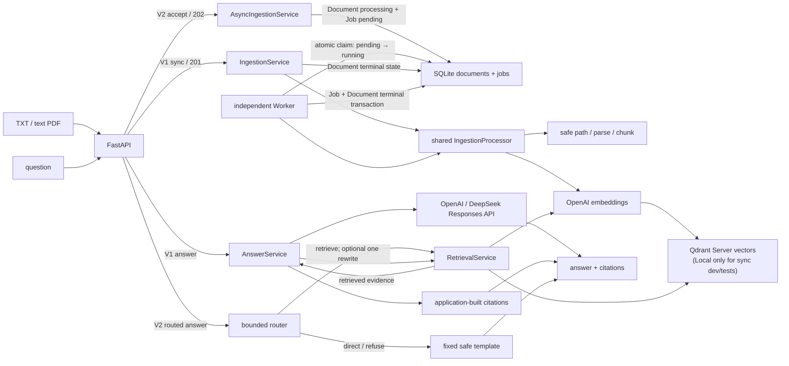

# Enterprise Knowledge Assistant（RAG 应用 + 异步摄取 + 工程评测）

**一句话介绍：** 面向高校公开课程资料（课程大纲、学分、先修关系等）的 RAG 知识问答后端作品集，以 FastAPI、SQLite 和 Qdrant 实现可追溯问答与异步摄取，重点展示 AI 应用/Python 后端工程能力和实验驱动的技术取舍。

**一分钟介绍：** 本项目以高校公开课程资料为具体应用与检索实验场景，后端支持 TXT/PDF 摄取、限定文档检索、证据约束回答和应用侧引用。工程上保留同步接口，并提供持久化 Job、独立 Worker 和固定崩溃点恢复；实验上使用 44 份高校公开课程大纲与固定 100 题开展图检索对照，保留收益和失败结果，图检索及自动构图均未接入业务主链路。高校资料让技术验证有具体对象，但项目核心仍是可运行、可测试、可解释的 AI 后端作品集，不是已面向师生运营的课程助手产品；2023 年大纲也不代表当前选课或培养要求。

> 当前状态：V1 应用闭环、V2 评测增强、R1 Qdrant Server、R23 最小异步
> 摄取闭环和 R4 同步/异步取舍实测已完成；R5 冻结了受限 Agentic
> Retrieval 对照协议，R6 随后实现了一个三分类、有界、可解释的路由控制器。
> 现有 `POST /api/v1/documents` 仍同步完成摄取并返回
> `201 Created`；新增 `POST /api/v2/documents` 返回 `202 Accepted + job_id`，
> 由一个独立 Worker 处理，并支持状态查询和一个固定崩溃点的启动恢复。推荐用
> Docker Compose 启动 FastAPI、Worker 与 Qdrant Server。当前只保证本机单
> Worker，不是分布式任务平台。应用检索仍使用 Dense；Hybrid 仅是被评测并
> 拒绝上线的实验原型。R6 的 `POST /api/v2/answers` 只会路由到检索、固定模板
> 直接回答或安全拒答，Evidence 不足时最多确定性改写并再检索一次；它不是通用
> Agent，也不是 GraphRAG。R7人工图对照与自动构图实验已运行，均未获准接入生产。
> 详见下方实验收口说明。项目面向本地单用户演示，
> 尚未提供认证、多租户或公网生产部署能力。

## 项目亮点

- 模块化单体：HTTP、业务服务、领域模型、provider 和存储适配器分层。
- 安全摄取：扩展名与媒体类型双重校验、大小限制、安全路径和失败回滚。
- 最小可靠异步摄取：持久化 Job、独立 Worker、原子领取、可查询状态、固定
  崩溃点恢复和删除竞态保护，同时保留 V1 同步接口。
- 范围检索：请求必须显式选择文档，检索前后均验证 `document_id`。
- 可信引用：文件名、页码、chunk ID 和分数由应用从真实检索结果构造。
- 隐私边界：不记录问题、文档内容、prompt、回答、向量、密钥或本地路径。
- 可重复评估：10 份合成文档、50 道题；离线门槛不使用 API Key。
- 证据化取舍：参数消融、真实语义对照、阈值扫描、Hybrid负向实验和坏案例目录。
- 性能观测：独立记录本机离线检索与回答编排P50/P95，不冒充线上延迟。
- 异步取舍实测：分别测量 API 接收、端到端、连续上传、响应性和崩溃恢复，
  明确“更快返回”与“更快完成”不是同一件事。
- 受限路由：新增兼容的 V2 Answer 入口，使用拒答优先、事实问题默认检索和至多
  一次确定性改写；问候/帮助与拒答路径不调用 Retrieval 或 LLM。
- 自动质量门槛：Ruff、85% 分支覆盖率、全量测试和离线评估进入 CI。
- 可复现运行：Compose 包含 FastAPI、Worker 与 Qdrant Server 三个服务，并用
  独立 named volume 保存 SQLite/上传文件与 Qdrant 数据。
- 多模型后端：OpenAI/DeepSeek 通过同一 `LLMProvider` 接口切换，业务服务
  不依赖具体厂商；在线对比使用相同检索证据、Prompt 和评测问题。

## 架构



V1 同步路径在请求内调用共享摄取核心；V2 路径先保存文件并原子创建
Document/Job，再由独立 Worker 领取、解析、切块、embedding 和写入 Qdrant。
摄取失败时会补偿清理向量和文件，并把 Job/Document 共同收敛到失败状态。
检索与回答仍是：限定文档检索 → 基于证据回答 → 应用侧结构化引用。

## 推荐启动（Docker Compose / R23 三服务）

R23 的运行拓扑是 `api`、`worker` 与 `qdrant`。API 和 Worker 共享
`app_data` 中的 SQLite/上传文件，但各自持有独立 SQLite 连接；两者都通过
网络访问 Qdrant Server，不共享 Qdrant Local 内部文件。

### 1. 准备配置

```powershell
Copy-Item .env.example .env
```

`.env` 已被 Git 忽略。独立 Worker 需要 `OPENAI_API_KEY` 才能启动处理任务；
仅启动容器不会调用 Provider，真正上传文档后才会生成 embedding。完整
`/health`、在线上传和问答也需要对应 Key。构建镜像、启动 Qdrant 和运行离线
测试不会调用 Provider。不要把 Key 写入镜像、提交、日志、聊天或截图；在线
调用可能产生费用。

### 2. 构建并启动

```powershell
docker compose up -d --build
docker compose ps
```

正常时 `api`、`qdrant` 为 `healthy`，`worker` 为 `Up`（Worker 当前没有单独
health endpoint）。Qdrant 匿名 telemetry 在 Compose 中显式关闭。端口仅绑定到
宿主机 `127.0.0.1`：API 默认是 <http://127.0.0.1:8000>，Qdrant 默认是
<http://127.0.0.1:6333>。

### 3. 数据持久化与停止

- `app_data` 保存容器内的 SQLite 和上传文件；
- `qdrant_data` 保存 Qdrant Server collection、向量和 payload；
- `docker compose down` 会移除容器和网络，但保留这两个 named volume；
- `docker compose down --volumes` 或 Docker Desktop factory reset 会删除
  named volume，除非明确准备清空数据，否则不要使用；
- 旧的宿主机 `data/qdrant` 是 Qdrant Local 内部数据，R1 不直接复制其内部
  文件到 Server；需要时应通过受控重新摄取重建索引。

停止服务但保留数据：

```powershell
docker compose down
```

## 兼容启动（Windows / Python 3.12 / Qdrant Local）

这种方式用于 V1 同步单进程开发和离线测试。保持 `RAG_QDRANT_URL` 为空时，
应用继续使用 `RAG_QDRANT_PATH` 下的 Local 数据，不需要启动 Docker。不要让
API 与独立 Worker 两个进程同时打开同一 Qdrant Local 目录；R23 异步运行和
进程恢复必须使用 Qdrant Server。

### 1. 创建项目专用虚拟环境

以下命令只在当前项目创建 `.venv`，不会修改其他课程项目的环境：

```powershell
py -3.12 -m venv .venv
```

### 2. 安装依赖

开发依赖包含运行依赖和 pytest。该兼容模式的 Qdrant 在 Python 进程内运行，
不需要另外启动 Qdrant Server、Ollama 或本地模型：

```powershell
.\.venv\Scripts\python.exe -m pip install -r requirements-dev.txt
```

### 3. 配置本地环境

复制安全模板后，在 `.env` 的 `OPENAI_API_KEY=` 后填入自己的 Key。默认
OpenAI 同时负责 embedding 和回答；切换 DeepSeek 回答时再配置
`DEEPSEEK_API_KEY`：

```powershell
Copy-Item .env.example .env
```

`.env` 已被 Git 忽略。不要把 Key 粘贴到聊天、截图、Issue、日志或提交中。
离线测试和评估不需要 Key；上传、检索、回答和 `/health` 完整健康状态需要 Key。

### 4. 先运行质量门槛

此命令依次检查 Ruff lint/格式、带分支覆盖率的测试、依赖完整性、Python
编译和离线 RAG 评估：

```powershell
.\.venv\Scripts\python.exe scripts\check_quality.py
```

成功时最后一行是：

```text
quality_gate_passed=true
```

质量门槛还会检查 Ruff 代码规范与格式，并要求应用分支覆盖率不低于 85%。

### 5. 启动 API

```powershell
.\.venv\Scripts\python.exe -m uvicorn app.main:app --host 127.0.0.1 --port 8000
```

看到 Uvicorn 启动信息后，打开 <http://127.0.0.1:8000/docs>。Swagger UI
会展示请求字段和响应模型，适合第一次体验完整流程。

## 五分钟演示流程

1. 调用 `GET /health`；配置有效时返回所有组件状态。
2. 调用 `POST /api/v2/documents`，上传
   `evaluation/documents/access_policy.txt`。
3. 从 `202` 响应中复制 `job_id` 和 `document_id`，调用
   `GET /api/v2/jobs/{job_id}`，观察 `pending → running → ready`。
4. 调用 `GET /api/v1/documents/{document_id}`，确认 Document 为 `ready`；再调用
   `POST /api/v1/answers`，提交下面的 JSON，并替换占位 ID：

```json
{
  "question": "How often is privileged access recertified?",
  "document_ids": ["<DOCUMENT_ID>"],
  "top_k": 5,
  "score_threshold": null
}
```

5. 检查回答中的 `citations`：每条引用都包含真实的文档、chunk、文件名、
   页码（PDF 可用时）、摘要和检索分数。
6. 调用 `DELETE /api/v1/documents/{document_id}` 清理文件、向量、Job 和文档
   记录。若摄取仍在进行，接口会返回 `409 DOCUMENT_PROCESSING`，不会与 Worker
   竞争删除。

这个在线演示会调用 OpenAI API 并产生少量费用。若只想验证本地工程链路，
运行离线评估即可。

## API

| 方法与路径 | 作用 |
|---|---|
| `GET /health` | 检查 SQLite、Qdrant、embedding 和 LLM provider |
| `POST /api/v1/documents` | 同步上传并摄取 UTF-8 TXT 或文本型 PDF |
| `POST /api/v2/documents` | 保存文件并创建异步 Job，返回 `202 + job_id` |
| `GET /api/v2/jobs/{job_id}` | 查询 Job 状态、尝试次数、时间戳和安全错误码 |
| `GET /api/v1/documents` | 列出不含本地路径的文档元数据 |
| `GET /api/v1/documents/{document_id}` | 获取单个文档记录 |
| `DELETE /api/v1/documents/{document_id}` | 删除文件、向量和文档记录 |
| `POST /api/v1/search` | 在明确选择的文档中检索 Top-K chunks |
| `POST /api/v1/answers` | 返回基于检索证据的回答和结构化引用 |
| `POST /api/v2/answers` | 三分类路由；事实问题检索，Evidence 不足时至多改写重试一次 |

所有应用错误使用稳定结构，并通过 `X-Request-ID` 关联请求：

```json
{
  "error": {
    "code": "DOCUMENT_NOT_FOUND",
    "message": "The requested document was not found.",
    "request_id": "..."
  }
}
```

## 配置

所有配置项都记录在 [.env.example](.env.example)。常用项如下：

| 变量 | 默认值 | 说明 |
|---|---|---|
| `OPENAI_API_KEY` | 空 | 在线 embedding 和默认 OpenAI 回答所需，永不提交 |
| `DEEPSEEK_API_KEY` | 空 | 选择 DeepSeek 回答或运行模型对比时所需，永不提交 |
| `RAG_EMBEDDING_MODEL` | `text-embedding-3-small` | 单一 embedding provider |
| `RAG_LLM_PROVIDER` | `openai` | 回答后端：`openai` 或 `deepseek` |
| `RAG_LLM_MODEL` | `gpt-5.6-sol` | 当前回答后端的模型；DeepSeek 使用 `deepseek-v4-flash` |
| `RAG_DEEPSEEK_BASE_URL` | `https://api.deepseek.com` | DeepSeek 官方 OpenAI-compatible API |
| `RAG_QDRANT_PATH` | `data/qdrant` | `RAG_QDRANT_URL` 为空时使用的 Local 数据目录 |
| `RAG_QDRANT_URL` | 空 | Qdrant Server 地址；设置后不再打开 Local path |
| `RAG_QDRANT_API_KEY` | 空 | 受保护的远程 Qdrant 可选密钥，不进入日志或 Git |
| `RAG_QDRANT_TIMEOUT_SECONDS` | `5` | Qdrant Server 客户端超时秒数 |
| `RAG_QDRANT_PORT` | `6333` | Compose 暴露到本机回环地址的 Qdrant 端口 |
| `RAG_SQLITE_PATH` | `data/app.db` | 文档记录数据库 |
| `RAG_SQLITE_BUSY_TIMEOUT_MS` | `5000` | API/Worker 遇到 SQLite 写锁时的有限等待时间 |
| `RAG_WORKER_POLL_INTERVAL_SECONDS` | `0.5` | 单 Worker 无待处理 Job 时的轮询间隔 |
| `RAG_MAX_UPLOAD_BYTES` | `10485760` | 单文件最大 10 MiB |
| `RAG_CHUNK_SIZE` | `1000` | chunk 字符目标大小 |
| `RAG_CHUNK_OVERLAP` | `150` | 相邻 chunk 重叠字符数 |
| `RAG_LOG_LEVEL` | `INFO` | `DEBUG/INFO/WARNING/ERROR/CRITICAL` |

## Multi-LLM Backend

项目保留 OpenAI embedding 和 Dense Qdrant 检索，只允许切换最后的回答模型。
DeepSeek 通过现有 `openai` Python SDK 访问官方 Responses API，不需要安装
DeepSeek SDK、Ollama 或本地模型。

默认 OpenAI 回答配置：

```dotenv
RAG_LLM_PROVIDER=openai
RAG_LLM_MODEL=gpt-5.6-sol
RAG_LLM_REASONING_EFFORT=low
```

DeepSeek V4 Flash 回答配置：

```dotenv
RAG_LLM_PROVIDER=deepseek
RAG_LLM_MODEL=deepseek-v4-flash
RAG_LLM_REASONING_EFFORT=none
```

两个后端复用相同的 grounded prompt、无证据标记和应用侧 Citation 构造。
Provider 返回统一的输入、缓存输入、输出和 reasoning token 统计，便于记录
延迟和估算成本。DeepSeek Responses API 当前采用 `deepseek-v4-flash`；旧的
`deepseek-chat`/`deepseek-reasoner` 不作为配置示例。

可选的在线对比会把已跟踪的合成语料发送到 OpenAI 和 DeepSeek，并产生 API
费用，因此必须显式确认：

```powershell
.\.venv\Scripts\python.exe scripts\run_llm_comparison.py --confirm-online
```

对比程序先用 OpenAI embedding 完成一次共享检索，再把完全相同的证据分别
交给两个 LLM。结果包含参考答案 Token F1、回答/拒答行为、引用编号、LLM
延迟、Token usage 和价格快照估算费用，并写入 JSON 与 Markdown 报告。没有
两个 API Key 或没有 `--confirm-online` 时不会发送网络请求。

2026-08-11 使用10份合成文档和50道题完成正式在线对比：

| 指标 | OpenAI `gpt-5.6-sol` | DeepSeek `deepseek-v4-flash` |
|---|---:|---:|
| 参考答案 Token F1 | 75.15% | 72.58% |
| 回答/拒答行为准确率 | 100.00% | 91.67% |
| 引用编号有效率 | 100.00% | 100.00% |
| 应用侧 Citation 完整率 | 100.00% | 100.00% |
| 平均 LLM 延迟 | 1771.45 ms | 912.84 ms |
| P95 LLM 延迟 | 3430.64 ms | 1143.56 ms |
| 估算 API 费用 | $0.106270 | $0.002195 |

结果表明：当前提示词下 OpenAI 的回答/拒答行为更稳定；DeepSeek 平均延迟更低、
估算成本显著更低，但在4道改写或低分证据题上过早拒答。因此默认后端仍保留
OpenAI，DeepSeek 作为可切换的低成本后端，不依据一次小型合成评测宣称模型
整体优劣。完整逐题结果见
[`evaluation/llm_comparison_report.md`](evaluation/llm_comparison_report.md) 和
[`evaluation/llm_comparison_report.json`](evaluation/llm_comparison_report.json)。

## 测试与离线评估

仅运行测试：

```powershell
.\.venv\Scripts\python.exe -m pytest -q -W error
```

截至 R6 收口前的本地完整质量门槛为 240 项自动化测试通过、3 项需要
Qdrant Server 的集成测试按当前环境跳过，另有 65 个参数化子测试通过；启用
分支统计后的总覆盖率为 88.90%，并持续强制 85% 的最低覆盖率要求。本项目连接
真实 Qdrant Server 验证了临时 collection 的写入、范围检索、删除和清理，也
用两个独立 Python 进程验证 Worker 在“Qdrant 已写入、SQLite 尚未提交 ready”
处退出后可恢复且没有重复可见 Chunk。CI 使用 Fake/确定性 Provider 和无 API
Key 的 Qdrant Server service，不调用真实 LLM/Embedding。

### R4 同步 / 异步摄取取舍

R4 使用相同的 8 KiB 合成 TXT、`1000/150` Chunk、固定 200 ms 的确定性
Embedding 和本机 Qdrant Server，对两条路径做预注册实测：

| P95 指标 | 同步 V1 | 异步 V2 |
| --- | ---: | ---: |
| 单次 API 接收 | 340.65 ms | 49.32 ms |
| 单次端到端 ready | 340.65 ms | 775.81 ms |
| 连续 5 份全部响应 | 1559.06 ms | 121.00 ms |
| 连续 5 份全部 ready | 1559.06 ms | 3192.49 ms |

异步路径还在固定崩溃点恢复成功，`attempt_count=2`，11 个可见 Chunk 无重复。
因此项目演示优先使用 V2 展示快速接收、状态查询和恢复，同时保留 V1 兼容；不能
表述成“异步端到端更快”或生产性能结论。协议、完整七维度解释和原始样本分别见
[`docs/r4_evaluation_protocol.md`](docs/r4_evaluation_protocol.md)、
[`docs/r4_sync_async_evaluation.md`](docs/r4_sync_async_evaluation.md) 和
[`evaluation/ingestion_benchmark_report.json`](evaluation/ingestion_benchmark_report.json)。

### R5 Agentic Retrieval 评测协议（无实现、无结果）

R5 只预注册未来实验的方法：Dense Top-5、预算匹配的 Dense Top-10 和最多
两轮的 Agentic 5×2。Top-10 用来控制“只是多取证据”的混杂因素；未来轨迹
还必须记录第二轮 Evidence 的 Jaccard/替换率、停止原因、失败分类、成本和
延迟。当前 10 份文档、50 道 RAG 题尚未具备 Agent 专用轨迹标注，因此不能
称为已完成 Agent 数据集或 Agent 结果。

完整协议见
[`docs/r5_agentic_retrieval_evaluation_protocol.md`](docs/r5_agentic_retrieval_evaluation_protocol.md)，
机器可校验清单见
[`evaluation/agentic_retrieval_protocol.json`](evaluation/agentic_retrieval_protocol.json)。
这段仍准确描述 R5 当时的交付：R5 没有实现或运行 Agentic 5×2。之后获得的
窄范围授权只允许 R6 实现受限路由控制器；它没有执行这组三臂检索实验。

### R6 受限路由控制器（已实现并完成离线边界评测）

R6 新增 `POST /api/v2/answers`，但保留 V1 Answer 行为不变。控制器先按
`refuse → direct_answer → retrieve` 的保守顺序分类：只有问候、系统能力和
使用方法能走固定模板直接回答，所有事实问题默认要求所选文档 Evidence。
第一轮结果不足时最多执行一次确定性查询改写，并保持相同 `document_ids`；总
检索调用上限为 2，不使用 LangGraph、Memory、Multi-Agent 或循环规划。

在实现前冻结的 36 条路由样例和 12 条重试样例上，首次离线运行分别为
36/36 和 12/12；事实问题误走直接回答、超过调用上限和文档范围越界均为 0。
该结果没有网络、Embedding/LLM 调用、token 或费用，只验证人工构造的边界
fixture，不能写成开放域 Agent 准确率或生产流量结论。设计、冻结协议和完整
逐题报告见 [`docs/r6_routing_agent_design.md`](docs/r6_routing_agent_design.md)、
[`evaluation/r6_routing_protocol.json`](evaluation/r6_routing_protocol.json) 和
[`evaluation/r6_routing_report.json`](evaluation/r6_routing_report.json)。R7
学校语料与 Graph Retrieval 对照及独立自动构图实验已执行，结果如下。

### R7实验收口（2026-09-10）

- 学校44份2023大纲、固定100题的三组对照：有Gold的89题上，Dense Recall@5为
  83.33%，Graph+Dense为91.76%；但完整路径得分43.52%低于90%门槛，且实验弱规则
  在11道应拒答题全部误应答。因此不接入生产，不能宣传可靠多跳推理或拒答。
- 自动构图独立实验：4来源冒烟后，在其余40来源生成179节点139边；输入是人工审核过的
  结构文本。格式/引用检查通过不等于语义正确，仍有专业组合节点及中英名称粒度问题，
  独立人工审核未完成，候选图隔离，不声称原始PDF全自动GraphRAG。
- [人工图正式报告](docs/r7_formal_result_20260910.md)与
  [自动构图结果/复现边界](docs/r7_auto_graph_result_20260910.md)分别记录，不混用指标。
- 结果尚未提交/推送时，远端README、CI和本地状态并不等同。新机器可运行离线测试；
  真实语料、许可和本地缓存另有条件，不能宣称clone即可重现付费实验。

仅运行评估：

```powershell
.\.venv\Scripts\python.exe scripts\run_evaluation.py
```

评估集包含 10 份合成文档和 50 道题，覆盖直接命中、多 chunk 证据、文档
范围隔离、不可回答、改写、相似事实干扰、低词法重叠和歧义问题。当前离线
Hashing 基线用于工程回归，不代表线上真实语义效果：

| 指标 | 结果 |
|---|---:|
| Top-5 来源命中率 | 90.00% |
| Evidence Recall@5 | 82.50% |
| MRR | 0.7937 |
| 多 chunk 通过率 | 100% |
| 文档范围隔离 | 100% |
| 不可回答问题拒答率 | 87.50% |
| 引用完整性 | 100% |
| PDF 页码准确率 | 100% |
| 删除一致性 | 通过 |

离线 provider 是确定性的词法 hashing 实现，用来验证工程回归，不冒充真实
OpenAI embedding/LLM 的语义质量。完整方法和逐题结果见
[evaluation/README.md](evaluation/README.md) 与
[evaluation/latest_report.json](evaluation/latest_report.json)。

V2 还包含参数消融、真实语义 Embedding 对照、阈值扫描和 Hybrid
（Dense + BM25 + RRF）离线原型。当前 Hybrid Hashing 对照没有提升
Evidence Recall@5，也没有减少检索失败案例；虽然 MRR 小幅增加 0.0063，
仍不足以修改生产检索策略。进一步使用真实语义 Embedding 对照后，Hybrid
Recall 从 100% 降至 92.50%，MRR 从 0.9833 降至 0.8438，并新增3个检索
失败案例，因此当前明确保留 Dense 检索。完整实验边界与结果见
[evaluation/README.md](evaluation/README.md)。

本地离线性能基准使用135个预热后样本：检索P50/P95约为
`7.64/7.93 ms`，完整回答编排约为`7.60/7.97 ms`。这些数字只描述当前
机器上的Hashing、临时本地Qdrant/SQLite和合成语料，不代表OpenAI网络
延迟或生产并发能力。已知失败按检索、阈值、回答策略和排序阶段记录在
`evaluation/bad_case_report.json`。

## 项目结构

```text
app/api                 HTTP 路由和依赖解析
app/core                类型化配置、日志、异常和错误处理
app/document_processing 文件校验、持久化、TXT/PDF 解析和切块
app/domain              框架无关的文档、Job、chunk、检索和引用模型
app/providers           OpenAI embedding/LLM 接口与适配器
app/services            同步/异步摄取、Worker、检索、回答和文档生命周期
app/storage             SQLite Document/Job repository 与 Qdrant adapter
.github/workflows       GitHub Actions 质量门槛与 Qdrant Server 集成测试
Dockerfile              API/Worker 共用的非 root Python 运行镜像
compose.yaml            FastAPI + Worker + Qdrant 三服务与 named volumes
evaluation              可重复语料、问题、provider 和评估报告
scripts                 语料生成、评估和质量门槛入口
tests                   单元、集成和评估测试
data                    被 Git 忽略的本地运行数据
docs                    调研、架构、provider 和发布记录
```

## 安全与限制

- 只绑定 `127.0.0.1`；不要直接暴露到公网或共享网络。
- V1 没有身份认证、权限控制、多租户隔离、限流或生产密钥管理。
- 只支持 UTF-8 TXT 和文本型 PDF；扫描件与 OCR 明确不支持。
- Compose 只绑定本机回环地址，Qdrant 未配置 TLS/认证；不要暴露到公网。
- SQLite 与当前单节点 Qdrant Server 仍面向本地小规模作品集，不是经真实流量
  验证的生产集群。
- R23 只实现单机、单 Worker 的最小闭环；没有业务自动重试队列、取消、背压、
  多 Worker、Lease/Fencing 或网络分区处理，不能包装成分布式任务平台。
- 活动摄取期间删除返回 `409 DOCUMENT_PROCESSING`；失败补偿是尽力而为，当前
  没有长期后台 reconciler。
- R6 只实现了进入 V2 Answer API 的受限规则路由和一次检索重试；R5 的
  Agentic 5×2、多步规划、Memory、Multi-Agent 和 R7 Graph Retrieval 都没有
  接入主链路，不能写成“完整 Agent 系统”或“生产级 GraphRAG”。
- LLM 请求不启用持久会话、工具或 Web 搜索；DeepSeek/OpenAI Key 均只从
  本地环境读取。
- 模型可能出错；结构化引用可追溯来源，但不等于事实保证。

更多安全说明见 [SECURITY.md](SECURITY.md)。

## 许可证

项目使用 [MIT License](LICENSE)。可以在保留版权和许可声明的前提下使用、
修改和分发；软件按原样提供，不附带担保。

## 设计依据

- [docs/architecture_log.md](docs/architecture_log.md)：V1 架构决策和质量边界。
- [docs/open_source_research.md](docs/open_source_research.md)：四个开源项目的调研证据。
- [docs/provider_decisions.md](docs/provider_decisions.md)：OpenAI provider 与隐私配置。
- [docs/mvp_scope.md](docs/mvp_scope.md)：最终 V1 范围与验收状态。
- [docs/release_checklist.md](docs/release_checklist.md)：发布前证据清单。
- [docs/r5_agentic_retrieval_evaluation_protocol.md](docs/r5_agentic_retrieval_evaluation_protocol.md)：
  受限 Agentic Retrieval 的三组对照、轨迹与失败分类协议；无实现、无结果。
